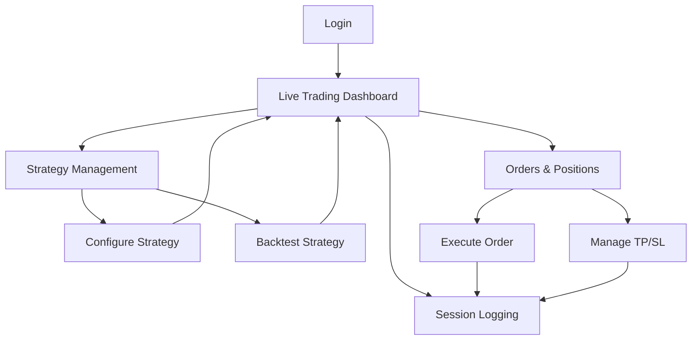

## 1. Product Overview
A professional trading dashboard that provides real-time market data visualization, automated strategy execution, and comprehensive order management. Designed for active traders who need live price feeds, strategy-based decision making, and full visibility of their trading positions with take-profit/stop-loss controls.

The dashboard helps traders monitor multiple strategies simultaneously, execute orders efficiently, and maintain detailed session logs for performance analysis and compliance tracking.

## 2. Core Features

### 2.1 User Roles
| Role | Registration Method | Core Permissions |
|------|---------------------|------------------|
| Trader | Email registration + KYC verification | Full access to trading features, strategy management, order execution |
| View-only User | Admin invitation | Can view dashboard and reports, cannot execute trades |
| Admin | Internal setup | User management, system configuration, audit access |

### 2.2 Feature Module
The trading dashboard consists of the following main pages:
1. **Live Trading Dashboard**: Real-time price charts, strategy signals, quick order execution
2. **Strategy Management**: Multi-strategy configuration, backtesting, performance metrics
3. **Orders & Positions**: Active orders, position tracking, TP/SL management, order history
4. **Session Logging**: Trading session records, performance analytics, audit trail

### 2.3 Page Details
| Page Name | Module Name | Feature description |
|-----------|-------------|---------------------|
| Live Trading Dashboard | Market Data Panel | Display real-time price feeds with bid/ask spreads, volume, and 24h change percentages for multiple trading pairs |
| Live Trading Dashboard | Price Charts | Interactive candlestick charts with multiple timeframes (1m, 5m, 15m, 1h, 4h, 1d) and technical indicators |
| Live Trading Dashboard | Strategy Signals | Show current strategy recommendations with entry/exit signals, confidence levels, and risk metrics |
| Live Trading Dashboard | Quick Order Panel | One-click order execution with predefined position sizes, market/limit order types, and risk management settings |
| Strategy Management | Strategy Configuration | Create and modify trading strategies with custom parameters, entry/exit rules, and risk management settings |
| Strategy Management | Multi-Strategy View | Monitor multiple active strategies simultaneously with performance metrics and current positions |
| Strategy Management | Backtesting Engine | Test strategy performance on historical data with detailed analytics and risk assessment |
| Orders & Positions | Active Orders | Display all open orders with status, fill progress, and modification capabilities |
| Orders & Positions | Position Tracker | Real-time position monitoring with unrealized P&L, margin requirements, and risk exposure |
| Orders & Positions | TP/SL Management | Visual representation of take-profit and stop-loss levels with drag-and-drop adjustment |
| Orders & Positions | Order History | Complete trade history with filtering, sorting, and export capabilities for analysis |
| Session Logging | Trading Sessions | Record and display individual trading sessions with duration, performance, and key metrics |
| Session Logging | Performance Analytics | Calculate and display key performance indicators including win rate, profit factor, and maximum drawdown |
| Session Logging | Audit Trail | Maintain comprehensive log of all user actions, order executions, and system events for compliance |

## 3. Core Process
**Trader Workflow:**
1. User logs into the dashboard and views real-time market data
2. Trader monitors strategy signals and market conditions on the main dashboard
3. Based on signals, trader executes orders through the quick order panel
4. System automatically applies predefined TP/SL levels to new positions
5. Trader monitors active positions and adjusts TP/SL levels as needed
6. All trading activities are logged for session tracking and compliance

**Strategy Management Flow:**
1. Trader accesses strategy management to configure or modify trading strategies
2. New strategies can be backtested against historical data
3. Approved strategies are activated and begin generating signals
4. Multiple strategies run simultaneously with independent risk management
5. Strategy performance is continuously monitored and logged

## 4. User Interface Design

### 4.1 Design Style
- **Primary Colors**: Deep blue (#1E3A8A) for primary actions, dark gray (#1F2937) for backgrounds
- **Secondary Colors**: Green (#10B981) for positive values/profits, red (#EF4444) for negative values/losses
- **Button Style**: Flat design with subtle shadows, rounded corners (4px radius)
- **Font**: Inter for UI elements, Roboto Mono for numerical data
- **Layout Style**: Grid-based layout with card-based components, professional trading terminal aesthetic
- **Icons**: Minimalist line icons for actions, filled icons for active states

### 4.2 Page Design Overview
| Page Name | Module Name | UI Elements |
|-----------|-------------|-------------|
| Live Trading Dashboard | Market Data Panel | Dark theme with neon-green/red price indicators, scrolling ticker, compact data tables with alternating row colors |
| Live Trading Dashboard | Price Charts | Full-width candlestick charts with volume bars, multiple overlay indicators, zoom/pan controls, crosshair cursor |
| Live Trading Dashboard | Strategy Signals | Card-based signal cards with color-coded confidence levels, animated entry/exit arrows, risk gauge meters |
| Live Trading Dashboard | Quick Order Panel | Compact order form with preset buttons, real-time position size calculator, risk/reward preview |
| Strategy Management | Strategy Configuration | Tabbed interface with form inputs, parameter sliders, rule builder with drag-drop conditions |
| Strategy Management | Multi-Strategy View | Grid layout showing strategy cards, sparkline performance charts, status indicators with traffic light colors |
| Orders & Positions | Active Orders | Data table with sortable columns, color-coded status badges, inline editing for price modifications |
| Orders & Positions | Position Tracker | Card-based position cards showing P&L charts, risk metrics, quick action buttons for closure |
| Orders & Positions | TP/SL Management | Visual chart overlay showing TP/SL lines with draggable handles, percentage-based risk display |
| Session Logging | Trading Sessions | Timeline view with session cards, performance badges, expandable detail panels with trade lists |
| Session Logging | Performance Analytics | Dashboard-style KPI cards, line charts for equity curves, bar charts for monthly performance |

### 4.3 Responsiveness
Desktop-first design approach with responsive breakpoints:
- Desktop (1920x1080+): Full multi-panel layout with side-by-side modules
- Tablet (1024x768): Stacked layout with collapsible panels
- Mobile (375x667+): Single-column view with swipe navigation between sections
- Touch optimization for chart interactions and order modifications on tablets

### 4.4 Real-time Data Display
- WebSocket connections for sub-second price updates
- Smooth animations for price changes with color transitions
- Auto-refresh indicators showing data freshness
- Connection status indicators with reconnection handling