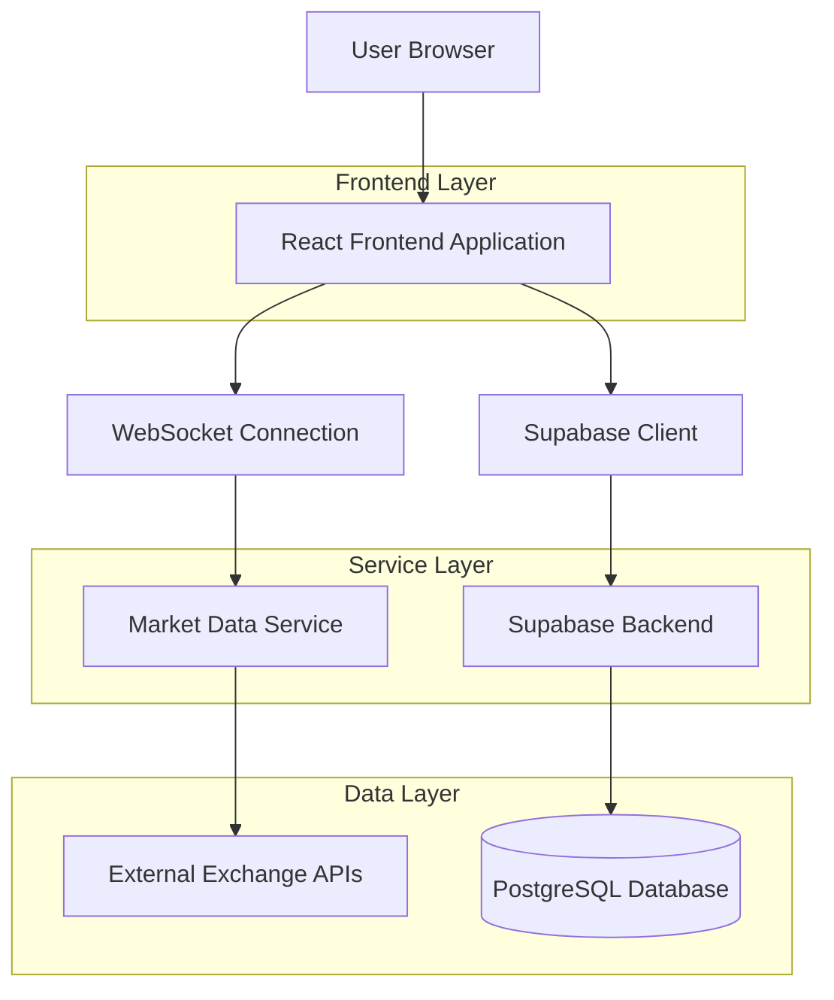
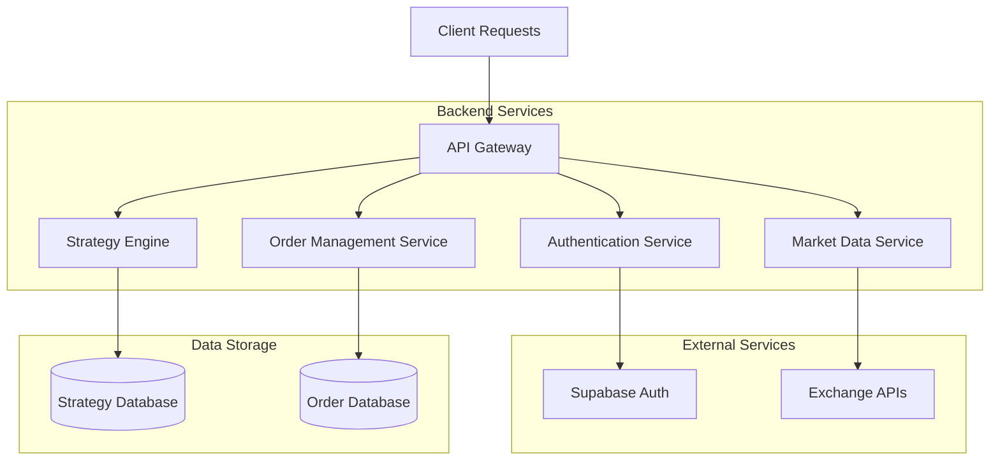
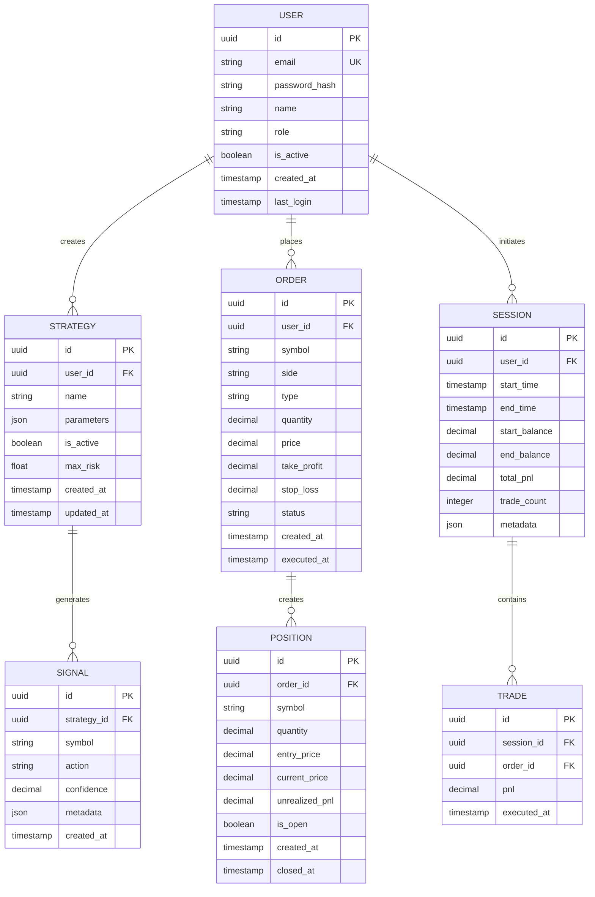

## 1. Architecture Design



## 2. Technology Description

- **Frontend**: React@18 + TypeScript + TailwindCSS@3 + Vite
- **Initialization Tool**: vite-init
- **Real-time Data**: WebSocket connections for live price feeds
- **Backend**: Supabase (PostgreSQL, Authentication, Real-time subscriptions)
- **Charting**: TradingView Charting Library / Lightweight Charts
- **State Management**: React Context + Zustand for complex state
- **UI Components**: HeadlessUI + Custom trading-specific components

## 3. Route Definitions

| Route | Purpose |
|-------|---------|
| / | Login page with authentication form |
| /dashboard | Main trading dashboard with live market data |
| /strategies | Strategy management and configuration |
| /orders | Order management and position tracking |
| /sessions | Trading session logs and analytics |
| /settings | User preferences and account settings |

## 4. API Definitions

### 4.1 Authentication APIs

```
POST /api/auth/login
```

Request:
| Param Name | Param Type | isRequired | Description |
|------------|------------|------------|-------------|
| email | string | true | User email address |
| password | string | true | User password |

Response:
| Param Name | Param Type | Description |
|------------|------------|-------------|
| token | string | JWT authentication token |
| user | object | User profile information |

### 4.2 Market Data APIs

```
GET /api/market/prices
```

Request:
| Param Name | Param Type | isRequired | Description |
|------------|------------|------------|-------------|
| symbols | string[] | true | Array of trading pair symbols |

Response:
| Param Name | Param Type | Description |
|------------|------------|-------------|
| prices | object[] | Array of price data with bid/ask/volume |

### 4.3 Strategy APIs

```
POST /api/strategies/execute
```

Request:
| Param Name | Param Type | isRequired | Description |
|------------|------------|------------|-------------|
| strategyId | string | true | Strategy identifier |
| symbol | string | true | Trading pair symbol |
| action | string | true | BUY/SELL action |
| quantity | number | true | Order quantity |

Response:
| Param Name | Param Type | Description |
|------------|------------|-------------|
| orderId | string | Generated order identifier |
| status | string | Order execution status |

### 4.4 Order Management APIs

```
POST /api/orders/create
```

Request:
| Param Name | Param Type | isRequired | Description |
|------------|------------|------------|-------------|
| symbol | string | true | Trading pair symbol |
| side | string | true | BUY/SELL |
| type | string | true | MARKET/LIMIT |
| quantity | number | true | Order quantity |
| price | number | false | Limit price (for limit orders) |
| takeProfit | number | false | Take profit price |
| stopLoss | number | false | Stop loss price |

Response:
| Param Name | Param Type | Description |
|------------|------------|-------------|
| orderId | string | Order identifier |
| status | string | Order status |
| createdAt | timestamp | Order creation time |

## 5. Server Architecture Diagram



## 6. Data Model

### 6.1 Data Model Definition



### 6.2 Data Definition Language

**Users Table**
```sql
CREATE TABLE users (
    id UUID PRIMARY KEY DEFAULT gen_random_uuid(),
    email VARCHAR(255) UNIQUE NOT NULL,
    password_hash VARCHAR(255) NOT NULL,
    name VARCHAR(100) NOT NULL,
    role VARCHAR(20) DEFAULT 'trader' CHECK (role IN ('trader', 'view_only', 'admin')),
    is_active BOOLEAN DEFAULT true,
    created_at TIMESTAMP WITH TIME ZONE DEFAULT NOW(),
    last_login TIMESTAMP WITH TIME ZONE,
    updated_at TIMESTAMP WITH TIME ZONE DEFAULT NOW()
);

-- Indexes
CREATE INDEX idx_users_email ON users(email);
CREATE INDEX idx_users_role ON users(role);
CREATE INDEX idx_users_active ON users(is_active);
```

**Strategies Table**
```sql
CREATE TABLE strategies (
    id UUID PRIMARY KEY DEFAULT gen_random_uuid(),
    user_id UUID REFERENCES users(id) ON DELETE CASCADE,
    name VARCHAR(100) NOT NULL,
    parameters JSONB NOT NULL DEFAULT '{}',
    is_active BOOLEAN DEFAULT true,
    max_risk DECIMAL(10, 4) DEFAULT 0.02,
    created_at TIMESTAMP WITH TIME ZONE DEFAULT NOW(),
    updated_at TIMESTAMP WITH TIME ZONE DEFAULT NOW()
);

-- Indexes
CREATE INDEX idx_strategies_user_id ON strategies(user_id);
CREATE INDEX idx_strategies_active ON strategies(is_active);
```

**Orders Table**
```sql
CREATE TABLE orders (
    id UUID PRIMARY KEY DEFAULT gen_random_uuid(),
    user_id UUID REFERENCES users(id) ON DELETE CASCADE,
    symbol VARCHAR(20) NOT NULL,
    side VARCHAR(4) NOT NULL CHECK (side IN ('BUY', 'SELL')),
    type VARCHAR(6) NOT NULL CHECK (type IN ('MARKET', 'LIMIT')),
    quantity DECIMAL(20, 8) NOT NULL,
    price DECIMAL(20, 8),
    take_profit DECIMAL(20, 8),
    stop_loss DECIMAL(20, 8),
    status VARCHAR(20) DEFAULT 'PENDING' CHECK (status IN ('PENDING', 'EXECUTED', 'CANCELLED', 'REJECTED')),
    created_at TIMESTAMP WITH TIME ZONE DEFAULT NOW(),
    executed_at TIMESTAMP WITH TIME ZONE,
    updated_at TIMESTAMP WITH TIME ZONE DEFAULT NOW()
);

-- Indexes
CREATE INDEX idx_orders_user_id ON orders(user_id);
CREATE INDEX idx_orders_symbol ON orders(symbol);
CREATE INDEX idx_orders_status ON orders(status);
CREATE INDEX idx_orders_created_at ON orders(created_at DESC);
```

**Positions Table**
```sql
CREATE TABLE positions (
    id UUID PRIMARY KEY DEFAULT gen_random_uuid(),
    order_id UUID REFERENCES orders(id) ON DELETE CASCADE,
    symbol VARCHAR(20) NOT NULL,
    quantity DECIMAL(20, 8) NOT NULL,
    entry_price DECIMAL(20, 8) NOT NULL,
    current_price DECIMAL(20, 8) NOT NULL,
    unrealized_pnl DECIMAL(20, 8) DEFAULT 0,
    is_open BOOLEAN DEFAULT true,
    created_at TIMESTAMP WITH TIME ZONE DEFAULT NOW(),
    closed_at TIMESTAMP WITH TIME ZONE,
    updated_at TIMESTAMP WITH TIME ZONE DEFAULT NOW()
);

-- Indexes
CREATE INDEX idx_positions_order_id ON positions(order_id);
CREATE INDEX idx_positions_symbol ON positions(symbol);
CREATE INDEX idx_positions_is_open ON positions(is_open);
```

**Sessions Table**
```sql
CREATE TABLE sessions (
    id UUID PRIMARY KEY DEFAULT gen_random_uuid(),
    user_id UUID REFERENCES users(id) ON DELETE CASCADE,
    start_time TIMESTAMP WITH TIME ZONE NOT NULL,
    end_time TIMESTAMP WITH TIME ZONE,
    start_balance DECIMAL(20, 8) NOT NULL,
    end_balance DECIMAL(20, 8),
    total_pnl DECIMAL(20, 8) DEFAULT 0,
    trade_count INTEGER DEFAULT 0,
    metadata JSONB DEFAULT '{}',
    created_at TIMESTAMP WITH TIME ZONE DEFAULT NOW(),
    updated_at TIMESTAMP WITH TIME ZONE DEFAULT NOW()
);

-- Indexes
CREATE INDEX idx_sessions_user_id ON sessions(user_id);
CREATE INDEX idx_sessions_start_time ON sessions(start_time DESC);
CREATE INDEX idx_sessions_total_pnl ON sessions(total_pnl DESC);
```

**Supabase Row Level Security Policies**
```sql
-- Grant basic read access to authenticated users
GRANT SELECT ON users TO authenticated;
GRANT SELECT ON strategies TO authenticated;
GRANT SELECT ON orders TO authenticated;
GRANT SELECT ON positions TO authenticated;
GRANT SELECT ON sessions TO authenticated;

-- Grant full access to users for their own data
CREATE POLICY "Users can view own data" ON users FOR SELECT USING (auth.uid() = id);
CREATE POLICY "Users can update own data" ON users FOR UPDATE USING (auth.uid() = id);

CREATE POLICY "Users can view own strategies" ON strategies FOR SELECT USING (auth.uid() = user_id);
CREATE POLICY "Users can manage own strategies" ON strategies FOR ALL USING (auth.uid() = user_id);

CREATE POLICY "Users can view own orders" ON orders FOR SELECT USING (auth.uid() = user_id);
CREATE POLICY "Users can create own orders" ON orders FOR INSERT WITH CHECK (auth.uid() = user_id);
CREATE POLICY "Users can update own orders" ON orders FOR UPDATE USING (auth.uid() = user_id);

CREATE POLICY "Users can view own positions" ON positions FOR SELECT USING (auth.uid() = (SELECT user_id FROM orders WHERE orders.id = positions.order_id));

CREATE POLICY "Users can view own sessions" ON sessions FOR SELECT USING (auth.uid() = user_id);
CREATE POLICY "Users can create own sessions" ON sessions FOR INSERT WITH CHECK (auth.uid() = user_id);
CREATE POLICY "Users can update own sessions" ON sessions FOR UPDATE USING (auth.uid() = user_id);
```